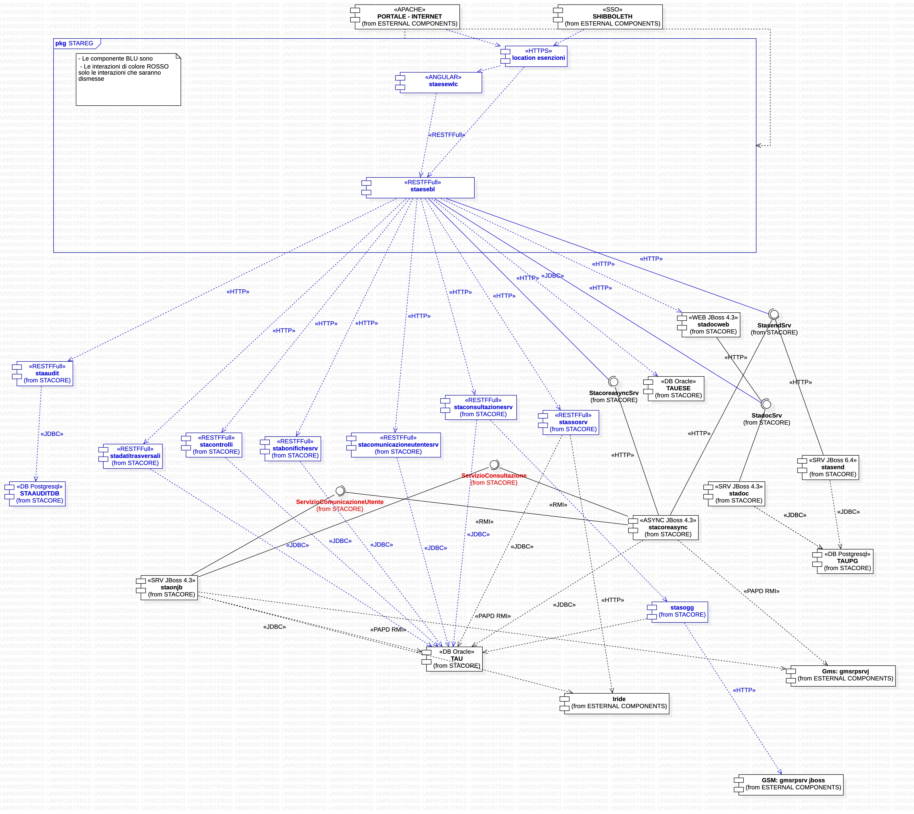
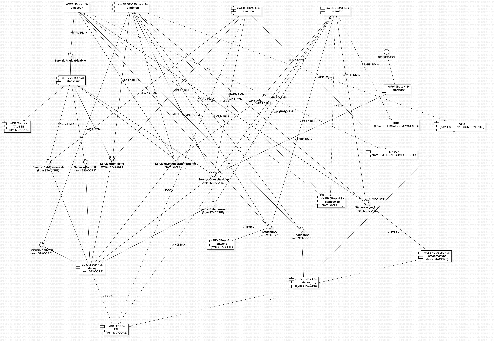

 STAAVVISISRV - RESTful API

Servizi per la gestione dei soggetti del sistema TAU.


### Architettura STAAVVISISRV

Descrizione dei moduli o tiers:

- **ear**: modulo che gestire il packaging delle APIs
- **api**: modulo che ospita i controller RESTful
- **business**: modulo che implementa la logica di business degli use-cases e le logiche di mapping from/to DTO 
- **integration**: modulo delegato all'integrazione con componenti esterne DB
- **util**: modulo che contiene classi di utility come costanti, parser JSON o XML
- **dto**: modulo che contiene classi di utility come costanti, parser JSON o XML


#### Database

##### DEV

XXX

##### TEST

XXX


### Requisiti ambiente di sviluppo

- OpenJDK 11
- Apache Maven 3.5.4 o superiore
- Wildfly 23 CSI

### Configurazione mirror maven

Il repository Maven CSI è [repart.csi.it/artifactory/maven2](http://repart.csi.it/artifactory/maven2/)

``` 
<mirror> 
    <id>csi-central</id> 
    <name>CSI Repart</name> 
	<url>http://repart.csi.it/maven2</url> 
	<mirrorOf>*</mirrorOf> 
 </mirror>
```

### Definizione e Creazione dei servizi REST

I nuovi servizi vanno prima definiti in formato `yaml` nel file `staavvisisrv-1.0.0-swagger.yaml` e successivamente
tramite l'utilizzo degli scripts:

`_gen_swagger.sh`

vengono generate le classi Java con tanto di annotation Swagger e Java Bean.


`_change_version.sh`

poi aggiornare la versione del .tar all'interno del pom padre, in particolare
va cambiata la properties:

`<ear.version>x.x.x</ear.version>`

### Ambienti

Per la fase di sviluppo vi è l'ambiente DEV mentre ad ogni rilascio ufficiale
le API sono versionate, viene creato un nuovo tag avente la seguente nomenclatura:

`TEST-<major>.<minor>.<patch>-<revision>`

a valle della creazione del tag le API sono dispiegate in ambiente di TEST tramite l'ausilio di
strumenti di continuous integration:

- Jenkins
- ADA

la stessa modalità è utilizzate per dispiegare le API in ambiente di COLLAUDO e PRODUZIONE.

#### Ambiente di DEV

Abbiamo disponibile il seguente application server Wildfly:

host: dev-wldsta01.csi.it

partizione: part089stacoresvnode01	

username/pwd: dev-wildfly-089 / mypass	

Console: http://dev-wldsta01.csi.it:18900	  admin / mypass	 

RAM: 1024	

portAJP = 18714
portHTTP = 18710


location apache:  http://dev-applogic.reteunitaria.piemonte.it/staavvisisrv


TEST RESOURCES:

http://dev-applogic.reteunitaria.piemonte.it/staavvisisrv/api/test/resources


#### Ambiente di TEST


ocation apache:  http://tst-applogic.reteunitaria.piemonte.it/staavvisisrv


### File properties

Per ogni ambiente in cui le API possono essere dispiegate, all'interno della directory
[stawap-web/buildfiles](staavvisisrv-api/buildfiles) troviamo un file `.properties`:

- dev-rp-01
- tst-rp-01
- coll-rp-01
- prod-rp-01

al loro interno vi sono i puntamenti verso le componenti esterne di cui STAAVVISISRV usufruisce.

### Datasource


Il datasource è configurato nello standalon.xml per cui non deve essere deployato come file ma configurato su jboss.
In ambiente di dev deve essere configurato via console, mutuando la configurazione dall'ambiente di test.


### Script SQL


### Nuovi Ambienti Oracle 12

10/11/2021
Inizio attività migrazione su Istanza Oracle 12
Di seguito i riferimenti ai nuovi ambienti di DEV e TEST

#### Ambiente di sviluppo

HOST/PORT/SID

TST-DOMDB72.CSI.IT/1521/SVI12PDB

#### Ambiente di test

HOST/PORT/SID

TST-DOMDB57.CSI.IT/1521/TST12PDB


# Diagrammi architetturali


## Dagrammi architetturali Esenzioni





## Dagrammi architetturali Rimborsi


### RIFERIMENTI AMBIENTI VECCHI BACK OFFICE RIMBOSTI/ESENZIONI


Le due applicazioni di back office sono innestate in un insieme di componenti di back office che viene definito come "gestionale".
Per accedere alle due componenti è necessario collegarsi al seguente indirizzo 

https://tst-portale.ruparpiemonte.it/tributi/tassaAuto/sta/stagesonjb

Entry point appartenente alla componente stageson

Le due componenti oggetto di reignerizzazione sono le componenti afferenti ai due link di testata:

esenzioni => staeseon
rimborsi  = starimon


Quindi nel sistema di back office attuale l'accesso non avviene direttamente sull'applicativo (esenzioni o rimborsi) ma passando dalla componente di entry point stageson.

Di seguito i riferimenti delle due applicazioni


## ESENZIONI

Prodotto STAREG

Le componenti coinvolte sono:


staeseon: componente di front end realizzata coon struts 1.2
staesesrv: componente a servizi esposto con EJB session stateless 2.1 wrappata con soluzione interna CSI PA/PD


Ambienti di test:

jboss 4.3 jdk 1.5

tst-jbsta01.csi.it/tst-jbsta02.csi.it

user: tst-jboss439-108
pwd: mypass

# git

https://gitlab.csi.it/prodotti/stareg/staeseon
https://gitlab.csi.it/prodotti/stareg/staesesrv


## RIMBORSI

Prodotto STAREG

Le componenti coinvolte sono:

starimon: componente di front end realizzata coon struts 1.2
La logica che deve essere riscritta sulla componente di bl si trova nell'interfaccia ServizioRimborsiInterface di staon


Ambienti di test:

jboss 4.3 jdk 1.5

tst-jbsta01.csi.it/tst-jbsta02.csi.it

user: tst-jboss439-108
pwd: mypass

# git

https://gitlab.csi.it/prodotti/stareg/starimon

# SVN

http://subversion.csi.it:10090/dsp/stacore/staon/

(a breve il porting su repo GIT)


## Dagrammi architetturali attuale 





